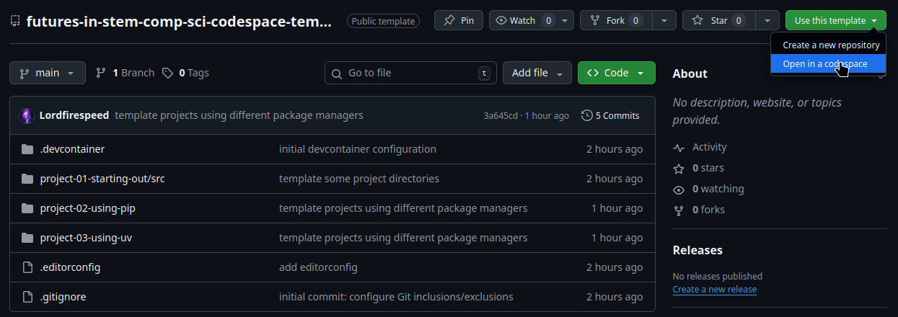
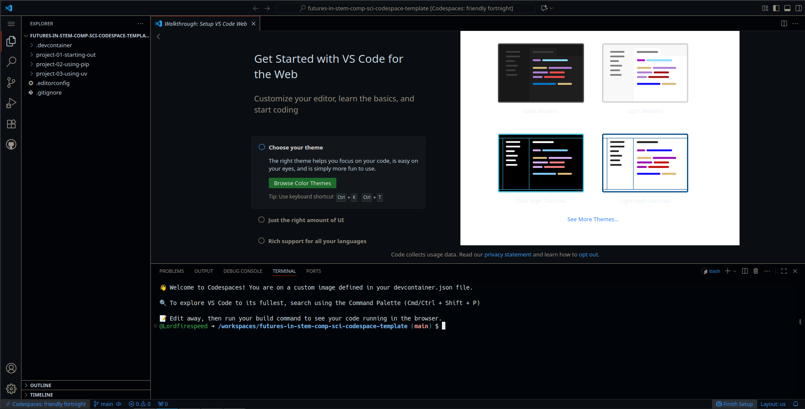
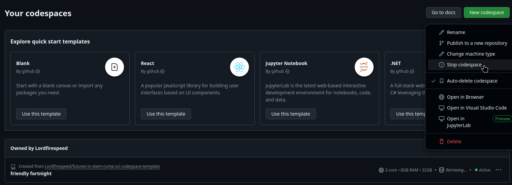

# Welcome!

To get started, sign in to your GitHub account (sign up for one if you haven't already).
Then follow the steps below to [create your codespace](#creating-your-codespace).

Finishing up? Make sure to [stop your codespace](#when-youre-finished)!

Not your first time? Follow the steps below to [resume your codespace](#resuming-your-codespace).

## Creating your codespace
1. Click the 'Use this Template' button at the top-right of this page, and choose 'Open in a codespace'.
   
2. A new browser tab should open, displaying the Visual Studio Code interface. 
   Your Codespace may take a few minutes to start up; however, once your codespace is created, it persists
   (associated with your GitHub account) until you choose to delete it. 
   In future sessions, you should only be resuming this codespace (instead of creating a new one every time),
   which should be a bit quicker.
3. Once your Codespace has started up and your browser has connected to it, you should be seeing something like this:
   
4. Follow the instructions in the 'Walkthrough: Setup VS Code Web' tab to configure the interface so that it is
   comfortable for you.

## When you're finished
GitHub Codespaces have some monthly usage limits.
To conserve your Codespace usage quotas, you should 'Stop' your codespace when you're finished using it.
Here's how:
1. Head over to https://github.com/codespaces.
2. Click the three dots at the right end of your codespace's tile and choose 'Stop codespace'.
   
3. Click the three dots at the right end of your codespace's tile and choose 'Auto-delete codespace' to disable codespace auto-deletion.
   If you don't do this, your codespace will be deleted after 30 days of inactivity and you'll lose any work you didn't commit and push using Git.

## Resuming your codespace
1. Head over to https://github.com/codespaces.
2. Click on your codespace's name to resume it and attach to it - note that your codespace will have been assigned a
   random name by GitHub. It might be a slightly wacky name!
3. A new browser tab should open, displaying the Visual Studio Code interface.
   Wait for your codespace to resume.
